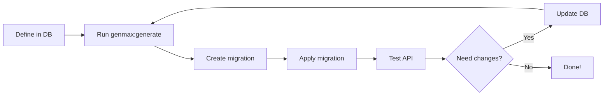

# Genmax Quick Start Guide

**Get started with Genmax in 5 minutes**

---

## Prerequisites

- Luminai project running (`docker-compose up -d`)
- Database initialized with `generator_entity` and `generator_property` tables

---

## Step 1: Define Your Entity

### Option A: Using SQL (Fastest)

```sql
-- Connect to database
docker-compose exec -T database psql -U luminai -d luminai

-- Create entity
INSERT INTO generator_entity (
    id,
    entity_name,
    entity_label,
    plural_label,
    api_enabled,
    dto_enabled,
    has_organization,
    api_operations,
    api_security
) VALUES (
    gen_random_uuid(),
    'Task',
    'Task',
    'Tasks',
    true,
    true,
    true,
    '["GetCollection", "Get", "Post", "Put", "Delete"]'::jsonb,
    'is_granted(''ROLE_USER'')'
);

-- Add properties
INSERT INTO generator_property (id, entity_id, property_name, property_label, property_type, length, nullable, validation_rules)
SELECT
    gen_random_uuid(),
    id,
    'title',
    'Title',
    'string',
    200,
    false,
    '[{"constraint": "NotBlank"}, {"constraint": "Length", "max": 200}]'::jsonb
FROM generator_entity WHERE entity_name = 'Task';

INSERT INTO generator_property (id, entity_id, property_name, property_label, property_type, nullable, default_value)
SELECT
    gen_random_uuid(),
    id,
    'isCompleted',
    'Completed',
    'boolean',
    false,
    'false'
FROM generator_entity WHERE entity_name = 'Task';
```

### Option B: Using PHP (Recommended for Complex Entities)

```php
// src/DataFixtures/TaskEntityFixture.php
namespace App\DataFixtures;

use App\Entity\Generator\GeneratorEntity;
use App\Entity\Generator\GeneratorProperty;
use Doctrine\Bundle\FixturesBundle\Fixture;
use Doctrine\Persistence\ObjectManager;

class TaskEntityFixture extends Fixture
{
    public function load(ObjectManager $manager): void
    {
        // Create entity
        $entity = new GeneratorEntity();
        $entity->setEntityName('Task');
        $entity->setEntityLabel('Task');
        $entity->setPluralLabel('Tasks');
        $entity->setApiEnabled(true);
        $entity->setDtoEnabled(true);
        $entity->setHasOrganization(true);
        $entity->setApiOperations(['GetCollection', 'Get', 'Post', 'Put', 'Delete']);
        $entity->setApiSecurity("is_granted('ROLE_USER')");

        $manager->persist($entity);

        // Title property
        $title = new GeneratorProperty();
        $title->setEntity($entity);
        $title->setPropertyName('title');
        $title->setPropertyLabel('Title');
        $title->setPropertyType('string');
        $title->setLength(200);
        $title->setNullable(false);
        $title->setFilterStrategy('partial');
        $title->setFilterOrderable(true);
        $title->setValidationRules([
            ['constraint' => 'NotBlank'],
            ['constraint' => 'Length', 'max' => 200]
        ]);

        $manager->persist($title);

        // Is Completed property
        $completed = new GeneratorProperty();
        $completed->setEntity($entity);
        $completed->setPropertyName('isCompleted');
        $completed->setPropertyLabel('Completed');
        $completed->setPropertyType('boolean');
        $completed->setNullable(false);
        $completed->setDefaultValue('false');
        $completed->setFilterBoolean(true);
        $completed->setFilterOrderable(true);

        $manager->persist($completed);

        // Due Date property
        $dueDate = new GeneratorProperty();
        $dueDate->setEntity($entity);
        $dueDate->setPropertyName('dueDate');
        $dueDate->setPropertyLabel('Due Date');
        $dueDate->setPropertyType('datetime_immutable');
        $dueDate->setNullable(true);
        $dueDate->setFilterDate(true);
        $dueDate->setFilterOrderable(true);

        $manager->persist($dueDate);

        $manager->flush();
    }
}
```

**Load fixtures:**
```bash
docker-compose exec app php bin/console doctrine:fixtures:load --append
```

---

## Step 2: Generate Code

```bash
# Generate all entities
docker-compose exec app php bin/console genmax:generate

# Or generate specific entity
docker-compose exec app php bin/console genmax:generate Task
```

**Output:**
```
[GENMAX] Starting code generation...
[GENMAX] Loaded entities: 1
[GENMAX] Creating backup...
[GENMAX] Backup created: var/backups/genmax_generation_20251024_143022
[GENMAX] Generating code for Task...
[GENMAX] Generated entity base class
[GENMAX] Generated entity extension class
[GENMAX] Generated API Platform config
[GENMAX] Generated Input DTO base class
[GENMAX] Generated Input DTO extension
[GENMAX] Generated Output DTO base class
[GENMAX] Generated Output DTO extension
[GENMAX] Generated State Processor
[GENMAX] Generated State Provider
[GENMAX] Generated Repository base
[GENMAX] Generated Repository extension
[GENMAX] Completed Task (100%)
[GENMAX] Code generation completed successfully
Files generated: 11
```

---

## Step 3: Create Migration

```bash
# Generate migration
docker-compose exec app php bin/console make:migration

# Review the migration file
# Then apply it
docker-compose exec app php bin/console doctrine:migrations:migrate --no-interaction
```

---

## Step 4: Test Your API

```bash
# Get API token (if needed)
# Use existing bearer token or login to get one

# Create a task
curl -X POST https://localhost/api/tasks \
  -H "Authorization: Bearer YOUR_TOKEN" \
  -H "Content-Type: application/json" \
  -k \
  -d '{
    "title": "Complete Genmax documentation",
    "isCompleted": false,
    "dueDate": "2025-10-31T23:59:59Z"
  }'

# List all tasks
curl -X GET https://localhost/api/tasks \
  -H "Authorization: Bearer YOUR_TOKEN" \
  -H "Accept: application/ld+json" \
  -k

# Search tasks
curl -X GET https://localhost/api/tasks?title=Genmax \
  -H "Authorization: Bearer YOUR_TOKEN" \
  -k

# Filter completed tasks
curl -X GET https://localhost/api/tasks?isCompleted=true \
  -H "Authorization: Bearer YOUR_TOKEN" \
  -k

# Sort by due date
curl -X GET "https://localhost/api/tasks?order[dueDate]=asc" \
  -H "Authorization: Bearer YOUR_TOKEN" \
  -k
```

---

## What Was Generated?

```
app/
├── config/api_platform/
│   └── Task.yaml                        # API Platform configuration
│
├── src/Entity/
│   ├── Task.php                         # ← Your customizable entity
│   └── Generated/
│       └── TaskGenerated.php            # ← Auto-generated base
│
├── src/Dto/
│   ├── TaskInputDto.php                 # ← Customize input
│   ├── TaskOutputDto.php                # ← Customize output
│   └── Generated/
│       ├── TaskInputDtoGenerated.php    # ← Auto-generated
│       └── TaskOutputDtoGenerated.php   # ← Auto-generated
│
├── src/State/
│   ├── TaskProcessor.php                # Handles create/update
│   └── TaskProvider.php                 # Handles read operations
│
└── src/Repository/
    ├── TaskRepository.php               # ← Add custom queries
    └── Generated/
        └── TaskRepositoryGenerated.php  # ← Auto-generated base
```

**Safe to edit:**
- `src/Entity/Task.php`
- `src/Dto/TaskInputDto.php`
- `src/Dto/TaskOutputDto.php`
- `src/Repository/TaskRepository.php`

**Never edit (always regenerated):**
- All files in `Generated/` folders
- `src/State/*Processor.php` and `*Provider.php`
- `config/api_platform/*.yaml`

---

## Common Patterns

### Add a Relationship

```php
// Add "assigned to user" relationship
$user = new GeneratorProperty();
$user->setEntity($entity);
$user->setPropertyName('assignedTo');
$user->setPropertyLabel('Assigned To');
$user->setRelationshipType('ManyToOne');
$user->setTargetEntity('App\\Entity\\User');
$user->setNullable(true);

$manager->persist($user);
$manager->flush();

// Regenerate
php bin/console genmax:generate Task
```

### Add Enum Support

```php
// Priority enum property
$priority = new GeneratorProperty();
$priority->setEntity($entity);
$priority->setPropertyName('priority');
$priority->setPropertyLabel('Priority');
$priority->setPropertyType('string');
$priority->setLength(20);
$priority->setDefaultValue('normal');
$priority->setValidationRules([
    [
        'constraint' => 'Choice',
        'choices' => ['low', 'normal', 'high', 'urgent']
    ]
]);
```

### Add Description Field

```php
$description = new GeneratorProperty();
$description->setEntity($entity);
$description->setPropertyName('description');
$description->setPropertyLabel('Description');
$description->setPropertyType('text');
$description->setNullable(true);
$description->setFilterStrategy('partial');
```

---

## Workflow Summary



---

## Troubleshooting

### Problem: "No entities found in database"

**Solution:** Check if GeneratorEntity records exist:
```sql
SELECT entity_name FROM generator_entity;
```

### Problem: Migration already exists error

**Solution:** Delete the migration file or apply it first:
```bash
rm app/migrations/VersionXXXXXXXXXXXXXX.php
```

### Problem: Property not appearing in API

**Solution:**
1. Check if property exists in `generator_property` table
2. Regenerate: `php bin/console genmax:generate`
3. Clear cache: `php bin/console cache:clear`

### Problem: Validation not working

**Solution:** Ensure `validationRules` is valid JSON:
```sql
SELECT property_name, validation_rules
FROM generator_property
WHERE entity_id = (SELECT id FROM generator_entity WHERE entity_name = 'Task');
```

---

## Next Steps

1. **Read full documentation:** `GENMAX.md`
2. **Add more properties:** Extend your entity
3. **Customize DTOs:** Add computed properties
4. **Add custom queries:** Extend `TaskRepository.php`
5. **Add business logic:** Extend `Task.php` entity

---

## Cheat Sheet

```bash
# Generate all entities
php bin/console genmax:generate

# Generate one entity
php bin/console genmax:generate EntityName

# Preview (dry run)
php bin/console genmax:generate --dry-run

# After generation
php bin/console make:migration
php bin/console doctrine:migrations:migrate

# Clear cache
php bin/console cache:clear

# Check generated API
curl -k https://localhost/api
```

---

**Ready to build? Start with Step 1!**

For detailed information, see `GENMAX.md` in this directory.
