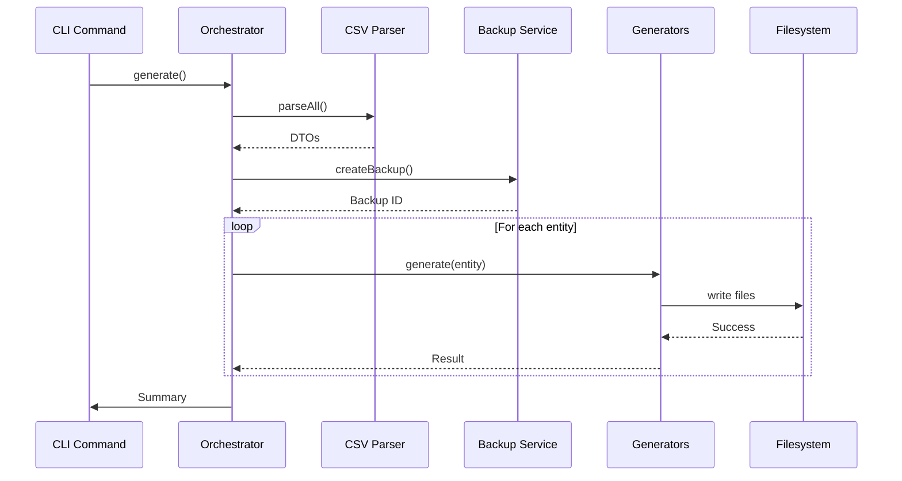

# Generator Developer Guide

## Table of Contents

1. [Architecture Overview](#architecture-overview)
2. [Component Deep Dive](#component-deep-dive)
3. [Template System](#template-system)
4. [Testing Strategy](#testing-strategy)
5. [Extension Points](#extension-points)
6. [Contributing](#contributing)

---

## Architecture Overview

### System Architecture

The TURBO Generator System follows a layered architecture:

```
┌──────────────────────────────────────────────────────┐
│                CLI Command Layer                      │
│  GenerateFromCsvCommand.php                          │
└────────────────────┬─────────────────────────────────┘
                     ▼
┌──────────────────────────────────────────────────────┐
│             Orchestration Layer                       │
│  GeneratorOrchestrator.php                           │
│  - Coordinates all generators                        │
│  - Manages generation workflow                       │
│  - Handles errors and rollback                       │
└────────────────────┬─────────────────────────────────┘
                     ▼
┌──────────────────────────────────────────────────────┐
│              CSV Processing Layer                     │
│  CsvParserService.php - Parse CSV files              │
│  CsvValidatorService.php - Validate data             │
│  EntityDefinitionDto.php - Entity metadata           │
│  PropertyDefinitionDto.php - Property metadata       │
└────────────────────┬─────────────────────────────────┘
                     ▼
┌──────────────────────────────────────────────────────┐
│            Code Generation Layer                      │
│  EntityGenerator - Entity classes                    │
│  ApiPlatformGenerator - API configs                  │
│  RepositoryGenerator - Repository classes            │
│  ControllerGenerator - Controller classes            │
│  VoterGenerator - Security voters                    │
│  FormGenerator - Form types                          │
│  TemplateGenerator - Twig templates                  │
│  NavigationGenerator - Menu updates                  │
│  TranslationGenerator - i18n updates                 │
└────────────────────┬─────────────────────────────────┘
                     ▼
┌──────────────────────────────────────────────────────┐
│             Test Generation Layer                     │
│  EntityTestGenerator - Entity tests                  │
│  RepositoryTestGenerator - Repository tests          │
│  ControllerTestGenerator - Controller tests          │
│  VoterTestGenerator - Voter tests                    │
└────────────────────┬─────────────────────────────────┘
                     ▼
┌──────────────────────────────────────────────────────┐
│              Utility Services                         │
│  BackupService - Backup/restore                      │
│  Twig Environment - Template rendering               │
│  Filesystem - File operations                        │
└──────────────────────────────────────────────────────┘
```

### Generation Flow



### Design Patterns

**1. Generated + Extension Pattern**

All generated code uses inheritance for safe customization:

```php
// Generated base (abstract, always regenerated)
abstract class ContactGenerated extends EntityBase
{
    // Auto-generated code
}

// Extension (concrete, safe to edit)
class Contact extends ContactGenerated
{
    // Custom code preserved
}
```

**2. Data Transfer Objects (DTOs)**

Immutable DTOs carry generation metadata:

```php
readonly class EntityDefinitionDto
{
    public function __construct(
        public string $entityName,
        public string $entityLabel,
        public array $properties,
        // ... all CSV columns
    ) {}
}
```

**3. Template Method Pattern**

Abstract generator base with template methods:

```php
abstract class AbstractGenerator
{
    abstract protected function getTemplateName(): string;
    abstract protected function getOutputPath(EntityDefinitionDto $dto): string;

    public function generate(EntityDefinitionDto $dto): GeneratorResult
    {
        // Template method implementation
    }
}
```

**4. Strategy Pattern**

Different generators for different layers:

```php
interface GeneratorInterface
{
    public function generate(EntityDefinitionDto $dto): GeneratorResult;
}

class EntityGenerator implements GeneratorInterface { }
class RepositoryGenerator implements GeneratorInterface { }
class ControllerGenerator implements GeneratorInterface { }
```

---

## Component Deep Dive

### CSV Parser Service

Parses CSV files into DTOs:

```php
// src/Service/Generator/Csv/CsvParserService.php

class CsvParserService
{
    private const ENTITY_CSV = '/config/EntityNew.csv';
    private const PROPERTY_CSV = '/config/PropertyNew.csv';

    public function parseAll(): array
    {
        $entities = $this->parseEntityCsv();
        $properties = $this->parsePropertyCsv();

        return [
            'entities' => $entities,
            'properties' => $properties,
        ];
    }

    private function parseEntityCsv(): array
    {
        // Read CSV with 25 columns
        // Return array of EntityDefinitionDto
    }

    private function parsePropertyCsv(): array
    {
        // Read CSV with 38 columns
        // Return array grouped by entity
    }
}
```

**Key Features**:
- CSV validation during parsing
- Type conversion (string → boolean, int)
- JSON parsing for complex fields
- Error reporting with line numbers

### CSV Validator Service

Validates parsed DTOs:

```php
// src/Service/Generator/Csv/CsvValidatorService.php

class CsvValidatorService
{
    public function validateAll(array $entities, array $properties): array
    {
        $errors = [];

        foreach ($entities as $entity) {
            $errors = array_merge($errors, $this->validateEntity($entity));
        }

        foreach ($properties as $entityProps) {
            $errors = array_merge($errors, $this->validateProperties($entityProps));
        }

        return [
            'valid' => empty($errors),
            'errors' => $errors,
        ];
    }

    private function validateEntity(EntityDefinitionDto $dto): array
    {
        // Check required fields
        // Validate naming conventions
        // Check icon format
        // Validate API configuration
        // Validate menu settings
    }

    private function validateProperties(array $properties): array
    {
        // Check entity exists
        // Validate property types
        // Validate relationships
        // Check form types
        // Validate constraints
    }
}
```

**Validation Rules**:
- Entity names: PascalCase, alphanumeric
- Property names: camelCase
- Types: Valid Doctrine types
- Relationships: Target entities exist
- Constraints: Valid Symfony validators

### Entity Generator

Generates entity classes using OrganizationTrait pattern:

```php
// src/Service/Generator/Entity/EntityGenerator.php

class EntityGenerator extends AbstractGenerator
{
    protected function getTemplateName(): string
    {
        return 'generator/entity.php.twig';
    }

    protected function getOutputPath(EntityDefinitionDto $dto): string
    {
        return sprintf(
            'src/Entity/Generated/%sGenerated.php',
            $dto->entityName
        );
    }

    public function generate(EntityDefinitionDto $dto): GeneratorResult
    {
        $files = [];

        // Generate OrganizationTrait if needed
        if ($dto->hasOrganization && !$this->traitExists()) {
            $files[] = $this->generateTrait();
        }

        // Generate entity base class
        $files[] = $this->generateEntityBase($dto);

        // Generate entity extension (once)
        if (!$this->extensionExists($dto)) {
            $files[] = $this->generateEntityExtension($dto);
        }

        return new GeneratorResult(true, $files);
    }

    private function generateTrait(): string
    {
        // Generate src/Entity/Trait/OrganizationTrait.php
        // Only generated once, provides organization support
    }
}
```

**Template Variables**:
```twig
{# templates/generator/entity.php.twig #}
namespace: App\Entity\Generated
className: {{ entityName }}Generated
baseClass: EntityBase
traits: [OrganizationTrait]
properties: {{ properties|json_encode }}
```

### Repository Generator

Generates repository with search/filter capabilities:

```php
// src/Service/Generator/Repository/RepositoryGenerator.php

class RepositoryGenerator extends AbstractGenerator
{
    public function generate(EntityDefinitionDto $dto): GeneratorResult
    {
        $files = [];

        // Generate repository base with search/filter methods
        $files[] = $this->generateRepositoryBase($dto);

        // Generate repository extension (once)
        if (!$this->extensionExists($dto)) {
            $files[] = $this->generateRepositoryExtension($dto);
        }

        return new GeneratorResult(true, $files);
    }

    private function generateSearchMethod(EntityDefinitionDto $dto): string
    {
        // Generate search() method for searchableFields
        $fields = $dto->searchableFields;
        // Build query with OR conditions
    }

    private function generateFilterMethods(EntityDefinitionDto $dto): string
    {
        // Generate filter methods for filterableFields
        $fields = $dto->filterableFields;
        // Build query builder methods
    }
}
```

**Generated Methods**:
- `search($query)` - Full-text search
- `findByFilters($filters)` - Multi-field filtering
- `findAllPaginated($page, $limit)` - Pagination
- `findByOrganization($org)` - Multi-tenant filtering

### Controller Generator

Generates CRUD controllers:

```php
// src/Service/Generator/Controller/ControllerGenerator.php

class ControllerGenerator extends AbstractGenerator
{
    public function generate(EntityDefinitionDto $dto): GeneratorResult
    {
        $actions = [
            'index' => $this->generateIndexAction($dto),
            'new' => $this->generateNewAction($dto),
            'show' => $this->generateShowAction($dto),
            'edit' => $this->generateEditAction($dto),
            'delete' => $this->generateDeleteAction($dto),
        ];

        return $this->renderController($dto, $actions);
    }

    private function generateIndexAction(EntityDefinitionDto $dto): string
    {
        // Handle search/filter from request
        // Use repository search methods
        // Paginate results
        // Render list template
    }
}
```

**Generated Routes**:
```php
#[Route('/contact', name: 'contact_')]
class ContactControllerGenerated extends AbstractController
{
    #[Route('/', name: 'index')]
    public function index() { }

    #[Route('/new', name: 'new')]
    public function new() { }

    #[Route('/{id}', name: 'show')]
    public function show() { }

    #[Route('/{id}/edit', name: 'edit')]
    public function edit() { }

    #[Route('/{id}/delete', name: 'delete', methods: ['POST'])]
    public function delete() { }
}
```

### Template Generator

Generates Twig templates for CRUD operations:

```php
// src/Service/Generator/Template/TemplateGenerator.php

class TemplateGenerator extends AbstractGenerator
{
    public function generate(EntityDefinitionDto $dto): GeneratorResult
    {
        $templates = [
            'index' => $this->generateIndexTemplate($dto),
            'form' => $this->generateFormTemplate($dto),
            'show' => $this->generateShowTemplate($dto),
        ];

        return new GeneratorResult(true, $templates);
    }

    private function generateIndexTemplate(EntityDefinitionDto $dto): string
    {
        // Table with sortable columns
        // Search form
        // Filters
        // Pagination
        // Action buttons
    }
}
```

### Navigation Generator

Updates base template with entity menu items:

```php
// src/Service/Generator/Navigation/NavigationGenerator.php

class NavigationGenerator
{
    private const MARKER_START = '<!-- GENERATOR_MENU_START -->';
    private const MARKER_END = '<!-- GENERATOR_MENU_END -->';

    public function generate(array $entities): GeneratorResult
    {
        $baseTemplate = file_get_contents('templates/base.html.twig');

        // Find marker positions
        $startPos = strpos($baseTemplate, self::MARKER_START);
        $endPos = strpos($baseTemplate, self::MARKER_END);

        // Generate menu items grouped by menuGroup
        $menuItems = $this->generateMenuItems($entities);

        // Replace content between markers
        $updated = substr($baseTemplate, 0, $startPos + strlen(self::MARKER_START))
            . "\n" . $menuItems . "\n"
            . substr($baseTemplate, $endPos);

        file_put_contents('templates/base.html.twig', $updated);

        return new GeneratorResult(true, ['templates/base.html.twig']);
    }
}
```

**Marker System**:
```twig
{# templates/base.html.twig #}
<nav>
    <!-- Custom menu items (preserved) -->

    <!-- GENERATOR_MENU_START -->
    {# Generated menu items #}
    <!-- GENERATOR_MENU_END -->

    <!-- More custom items (preserved) -->
</nav>
```

---

## Template System

### Twig Template Structure

All code is generated using Twig templates in `templates/generator/`:

```
templates/generator/
├── entity.php.twig                 # Entity class
├── repository.php.twig             # Repository class
├── controller.php.twig             # Controller class
├── voter.php.twig                  # Security voter
├── form.php.twig                   # Form type
├── api_platform.yaml.twig          # API config
├── index.html.twig.twig            # List template
├── form.html.twig.twig             # Form template
├── show.html.twig.twig             # Detail template
└── test/
    ├── entity_test.php.twig        # Entity test
    ├── repository_test.php.twig    # Repository test
    ├── controller_test.php.twig    # Controller test
    └── voter_test.php.twig         # Voter test
```

### Available Template Variables

Every template receives:

```twig
{# Entity metadata #}
{{ entityName }}           {# Contact #}
{{ entityLabel }}          {# Contact #}
{{ pluralLabel }}          {# Contacts #}
{{ icon }}                 {# bi-person #}
{{ description }}          {# Entity description #}

{# Flags #}
{{ hasOrganization }}      {# true/false #}
{{ apiEnabled }}           {# true/false #}
{{ voterEnabled }}         {# true/false #}
{{ testEnabled }}          {# true/false #}

{# Properties array #}

    {{ property.propertyName }}
    {{ property.propertyType }}
    {{ property.nullable }}
    {{ property.length }}
    {# ... all property fields #}


{# API configuration #}
{{ operations }}           {# [GetCollection, Get, Post] #}
{{ security }}             {# is_granted('ROLE_USER') #}
{{ searchableFields }}     {# [name, email] #}
{{ filterableFields }}     {# [status, active] #}

{# UI configuration #}
{{ menuGroup }}            {# CRM #}
{{ menuOrder }}            {# 10 #}
```

### Creating Custom Templates

To create a custom template:

1. **Create template file**:
```twig
{# templates/generator/my_custom.php.twig #}
<?php

declare(strict_types=1);

namespace App\{{ namespace }};

class {{ className }}
{
    // Your custom template code
}
```

2. **Create generator class**:
```php
class MyCustomGenerator extends AbstractGenerator
{
    protected function getTemplateName(): string
    {
        return 'generator/my_custom.php.twig';
    }

    protected function getOutputPath(EntityDefinitionDto $dto): string
    {
        return sprintf('src/MyCustom/%s.php', $dto->entityName);
    }
}
```

3. **Register in orchestrator**:
```php
class GeneratorOrchestrator
{
    public function generate(EntityDefinitionDto $dto): void
    {
        // ...
        $this->myCustomGenerator->generate($dto);
    }
}
```

---

## Testing Strategy

### Generated Test Structure

Each layer gets comprehensive tests:

**Entity Tests**:
```php
class ContactTest extends KernelTestCase
{
    public function testEntityCreation(): void { }
    public function testGettersAndSetters(): void { }
    public function testValidation(): void { }
    public function testRelationships(): void { }
}
```

**Repository Tests**:
```php
class ContactRepositoryTest extends KernelTestCase
{
    public function testFindAll(): void { }
    public function testSearch(): void { }
    public function testFilters(): void { }
    public function testPagination(): void { }
}
```

**Controller Tests**:
```php
class ContactControllerTest extends WebTestCase
{
    public function testIndex(): void { }
    public function testNew(): void { }
    public function testEdit(): void { }
    public function testDelete(): void { }
}
```

### Writing Generator Tests

Test generators themselves:

```php
// tests/Service/Generator/EntityGeneratorTest.php

class EntityGeneratorTest extends KernelTestCase
{
    private EntityGenerator $generator;

    public function testGenerateEntityWithOrganization(): void
    {
        $dto = new EntityDefinitionDto(
            entityName: 'TestEntity',
            hasOrganization: true,
            // ... other fields
        );

        $result = $this->generator->generate($dto);

        $this->assertTrue($result->isSuccess());
        $this->assertCount(2, $result->getGeneratedFiles());

        // Verify generated content
        $content = file_get_contents($result->getGeneratedFiles()[0]);
        $this->assertStringContainsString('use OrganizationTrait', $content);
    }
}
```

### Integration Tests

Test full generation workflow:

```php
class GeneratorIntegrationTest extends KernelTestCase
{
    public function testFullGeneration(): void
    {
        // Parse CSV
        $parser = $this->getContainer()->get(CsvParserService::class);
        $data = $parser->parseAll();

        // Validate
        $validator = $this->getContainer()->get(CsvValidatorService::class);
        $validation = $validator->validateAll($data['entities'], $data['properties']);
        $this->assertTrue($validation['valid']);

        // Generate
        $orchestrator = $this->getContainer()->get(GeneratorOrchestrator::class);
        $result = $orchestrator->generateAll();
        $this->assertTrue($result['success']);

        // Verify files exist
        $this->assertFileExists('src/Entity/Generated/ContactGenerated.php');
        $this->assertFileExists('src/Repository/ContactRepository.php');
        // ...
    }
}
```

---

## Extension Points

### Adding New Generators

1. **Create generator class**:
```php
namespace App\Service\Generator\MyLayer;

class MyLayerGenerator extends AbstractGenerator
{
    protected function getTemplateName(): string
    {
        return 'generator/my_layer.php.twig';
    }

    protected function getOutputPath(EntityDefinitionDto $dto): string
    {
        return "src/MyLayer/{$dto->entityName}.php";
    }
}
```

2. **Create template**:
```twig
{# templates/generator/my_layer.php.twig #}
<?php
// Template for your layer
```

3. **Register in services**:
```yaml
# config/services.yaml
App\Service\Generator\MyLayer\MyLayerGenerator:
    arguments:
        $twig: '@twig'
        $filesystem: '@filesystem'
```

4. **Add to orchestrator**:
```php
class GeneratorOrchestrator
{
    public function __construct(
        // ...
        private readonly MyLayerGenerator $myLayerGenerator,
    ) {}

    public function generate(EntityDefinitionDto $dto): void
    {
        // ...
        $this->myLayerGenerator->generate($dto);
    }
}
```

### Adding CSV Columns

To add new CSV columns:

1. **Update DTOs**:
```php
readonly class EntityDefinitionDto
{
    public function __construct(
        // ... existing fields
        public ?string $myNewField = null,
    ) {}
}
```

2. **Update parser**:
```php
class CsvParserService
{
    private const ENTITY_COLUMNS = [
        // ... existing columns
        'myNewField',
    ];

    private function parseEntityCsv(): array
    {
        // Add parsing logic
    }
}
```

3. **Update templates**:
```twig
{# templates/generator/entity.php.twig #}

    // Use new field

```

### Custom Validation Rules

Add custom validators:

```php
class CsvValidatorService
{
    private function validateEntity(EntityDefinitionDto $dto): array
    {
        $errors = [];

        // Add custom validation
        if ($dto->myField && !$this->isValidMyField($dto->myField)) {
            $errors[] = "Invalid myField value: {$dto->myField}";
        }

        return $errors;
    }

    private function isValidMyField(string $value): bool
    {
        // Custom validation logic
        return preg_match('/^[A-Z]/', $value);
    }
}
```

---

## Contributing

### Code Style

Follow Symfony coding standards:

```bash
# Check code style
vendor/bin/php-cs-fixer fix --dry-run --diff

# Apply fixes
vendor/bin/php-cs-fixer fix
```

### PHPStan Analysis

Maintain level 8 compliance:

```bash
vendor/bin/phpstan analyse src --level=8
```

### Pull Request Process

1. **Fork repository**
2. **Create feature branch**: `git checkout -b feature/my-feature`
3. **Write tests**: Cover new functionality
4. **Update documentation**: Document changes
5. **Run quality checks**:
```bash
php bin/phpunit
vendor/bin/phpstan analyse src --level=8
vendor/bin/php-cs-fixer fix
```
6. **Commit changes**: Use conventional commits
7. **Push to fork**: `git push origin feature/my-feature`
8. **Create pull request**

### Conventional Commits

Format: `type(scope): description`

Types:
- `feat`: New feature
- `fix`: Bug fix
- `docs`: Documentation
- `style`: Code style
- `refactor`: Code refactoring
- `test`: Tests
- `chore`: Maintenance

Examples:
```
feat(generator): add custom template support
fix(parser): handle empty CSV rows
docs(readme): update installation instructions
test(entity): add validation test cases
```

### Issue Reporting

When reporting issues, include:

1. **Description**: Clear description of the issue
2. **Steps to reproduce**: Detailed steps
3. **Expected behavior**: What should happen
4. **Actual behavior**: What actually happens
5. **Environment**: PHP version, OS, Symfony version
6. **Logs**: Relevant log excerpts
7. **CSV data**: Sample CSV causing the issue (if applicable)

---

## Resources

- **Symfony Documentation**: https://symfony.com/doc/current/
- **API Platform**: https://api-platform.com/docs/
- **Doctrine ORM**: https://www.doctrine-project.org/
- **Twig**: https://twig.symfony.com/
- **PHPUnit**: https://phpunit.de/

---

## Next Steps

- Review [User Guide](GeneratorUserGuide.md) for usage examples
- Check [Production Deployment](ProductionDeployment.md) for deployment
- Explore [Cheat Sheets](CheatSheets.md) for quick reference
