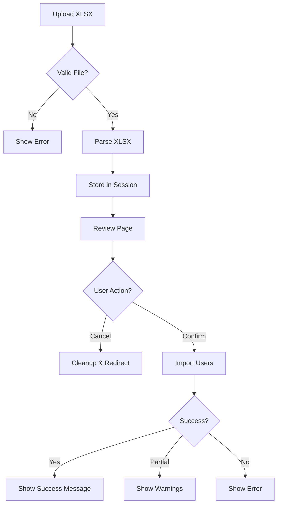

# User Import Feature

> **Feature Status**: ✅ **WORKING** (Fixed on 2025-10-19)

---

## 📋 Overview

The User Import feature allows administrators to bulk import users from Excel (XLSX) files into the Luminai system. This feature is designed to streamline user onboarding for organizations.

---

## 🚀 Quick Start

### For End Users

1. Navigate to **Users** (`/user`)
2. Click **"Import Users"** button in the header
3. Download the template file (optional but recommended)
4. Fill in your user data
5. Upload the file
6. Review the parsed data
7. Confirm import

### For Developers

```bash
# Test import programmatically
docker-compose exec -T app php bin/console app:test-user-import /path/to/file.xlsx

# Regenerate template file
php create_import_template.php
```

---

## 📊 File Format

### Template Structure

Download the official template from: `/templates/user_import_template.xlsx`

The template includes:
- **Row 1**: Column headers
- **Row 2**: Example data (can be deleted)
- **Rows 3+**: Your user data

### Column Headers

The import system supports **flexible header formats**. All of these will work:

| Column | Supported Headers | Required? |
|--------|------------------|-----------|
| **Email** | `email`, `Email`, `E-mail`, `Email (Required)`, `Email Address` | ✅ Yes |
| **Name** | `name`, `Name`, `Full Name`, `Name (Required)`, `nome` | ✅ Yes |
| **Password** | `password`, `Password`, `Password (Required)`, `senha`, `pass` | ✅ Yes |
| **Roles** | `roles`, `Roles`, `Role`, `Roles (Optional)`, `perfil`, `perfis` | ⚪ Optional |
| **OpenAI Key** | `openai api key`, `OpenAI API Key (Optional)`, `openai_api_key`, `API Key` | ⚪ Optional |

**Note**: The system is case-insensitive and strips out text in parentheses like `(Required)` or `(Optional)`.

### Example Data

```
email                    | name         | password      | roles              | openai_api_key
-------------------------|--------------|---------------|--------------------|-----------------
john.doe@example.com     | John Doe     | SecurePass123 | instructor         | sk-proj-...
jane.smith@example.com   | Jane Smith   | Pass123456    | student,instructor |
alice@example.com        | Alice Brown  | Alice2024!    | student            | sk-abc123...
```

---

## 🔧 Technical Details

### Architecture

```
UserImportController.php
  ├── upload()        → Display upload form
  ├── review()        → Review parsed data
  ├── confirm()       → Execute import
  └── cancel()        → Cancel and cleanup

UserImportService.php
  ├── parseXlsx()     → Parse Excel file
  ├── importUsers()   → Create User entities
  ├── mapColumns()    → Flexible header mapping ← FIXED!
  └── validateUserData() → Validate each row
```

### Routes

| Route | Method | Path | Description |
|-------|--------|------|-------------|
| `user_import_upload` | GET, POST | `/user/import/upload` | Upload XLSX file |
| `user_import_review` | GET | `/user/import/review` | Review parsed data |
| `user_import_confirm` | POST | `/user/import/confirm` | Confirm and import |
| `user_import_cancel` | GET | `/user/import/cancel` | Cancel import |

### Workflow



### Data Flow

1. **Upload**: File uploaded via form (`multipart/form-data`)
2. **Validation**: Check file extension (`.xlsx`, `.xls`) and size (max 5MB)
3. **Temporary Storage**: Move to `/tmp/user_import_<uniqid>.xlsx`
4. **Parsing**: Read with PhpSpreadsheet
5. **Column Mapping**: Flexible header matching
6. **Row Processing**: Extract and validate each row
7. **Session Storage**: Store parsed data in session
8. **Review**: Display valid users and errors
9. **Import**: Create User entities with Doctrine
10. **Cleanup**: Delete temp file and clear session

---

## 🐛 Bug History & Fixes

### Issue #4: Enhanced Duplicate Email Detection (Fixed 2025-10-19)

#### **Enhancement**
Improved duplicate email error messages to provide better context

#### **What Changed**
- **Before**: Generic error `"Email already exists: email@example.com"`
- **After**: Detailed errors with user and organization context:
  - Same org: `"Email already registered in your organization: 'email@example.com' (User: John Doe)"`
  - Different org: `"Email already registered in another organization: 'email@example.com' (User: Jane Smith in Acme Corp)"`

#### **Additional Improvements**
1. **Enhanced Review Page UI**:
   - More prominent error alert at the top
   - Clear action items explaining what users can do
   - Dismissible alert for better UX

2. **Better Database Error Handling**:
   - Added specific catch for `UniqueConstraintViolationException`
   - Safety net for any duplicates that slip through validation

3. **Bilingual Support**:
   - Updated English and Portuguese translations
   - Consistent messaging across languages

**Files Modified**:
- `app/src/Service/UserImportService.php:282-298` (Enhanced validation message)
- `app/src/Service/UserImportService.php:112-119` (Database error handling)
- `app/templates/user_import/review.html.twig:55-70` (Improved error alert)
- `app/translations/en/user.en.yaml:114-117` (New translations)
- `app/translations/pt_BR/user.pt_BR.yaml:114-117` (New translations)

### Issue #1: Column Mapping Failure (Fixed 2025-10-19)

#### **Symptom**
- Import resulted in 0 valid users and 0 errors
- Template file had headers like `Email (Required)`, but parser expected exact match `email`

#### **Root Cause**
The `mapColumns()` method in `UserImportService.php:127-148` used strict matching:

```php
// ❌ OLD CODE (BROKEN)
$map[$index] = match ($normalized) {
    'email', 'e-mail' => 'email',
    'name', 'full name', 'nome' => 'name',
    // ...
    default => null,
};
```

Headers like `"Email (Required)"` normalized to `"email (required)"`, which didn't match `"email"`.

#### **Fix**
Enhanced column mapping with:
1. **Pattern Stripping**: Remove `(text)` and `[text]` patterns
2. **Exact Match First**: Try cleaned value, then original
3. **Partial Matching**: Fallback to `str_contains()` for flexibility

```php
// ✅ NEW CODE (WORKING)
// Strip out (Required), (Optional), etc.
$cleaned = preg_replace('/\s*\([^)]*\)\s*/', '', $normalized);
$cleaned = preg_replace('/\s*\[[^\]]*\]\s*/', '', $cleaned);
$cleaned = trim($cleaned);

// Try exact match with cleaned value
foreach ([$cleaned, $normalized] as $value) {
    $result = match ($value) {
        'email', 'e-mail', 'e-mail address', 'email address' => 'email',
        // ... expanded keywords
        default => null,
    };
    if ($result !== null) break;
}

// Fallback to partial matching
if ($result === null) {
    if (str_contains($cleaned, 'email')) {
        $map[$index] = 'email';
    }
    // ... other fields
}
```

**File**: `app/src/Service/UserImportService.php:127-179`

### Issue #2: Wrong Method Name (Fixed 2025-10-19)

#### **Symptom**
```
Attempted to call an undefined method named "addRoleEntity" of class "App\Entity\User"
```

#### **Root Cause**
The `createUser()` method called `$user->addRoleEntity($role)`, but the actual method is `addRole()`.

#### **Fix**
```php
// ❌ OLD: $user->addRoleEntity($role);
// ✅ NEW: $user->addRole($role);
```

**File**: `app/src/Service/UserImportService.php:357`

### Issue #3: Type Mismatch in getColumnLetter (Fixed 2025-10-19)

#### **Symptom**
```
UserImportService::getColumnLetter(): Argument #1 ($index) must be of type int, string given
```

#### **Root Cause**
When calling `$sheet->rangeToArray()` with the 4th parameter set to `true`, it returns an associative array with column letters as keys (`'A'`, `'B'`, `'C'`), not integers.

#### **Fix**
Updated method signature to accept both `int` and `string`:

```php
// ❌ OLD: private function getColumnLetter(int $index): string
// ✅ NEW: private function getColumnLetter(int|string $index): string {
    if (is_string($index)) {
        return $index; // Already a column letter
    }
    return \PhpOffice\PhpSpreadsheet\Cell\Coordinate::stringFromColumnIndex($index);
}
```

**File**: `app/src/Service/UserImportService.php:245-260`

---

## ✅ Validation Rules

### Email
- ✅ Required
- ✅ Must be valid format
- ✅ Must be **globally unique** across all organizations
- ❌ Duplicate emails are rejected with detailed error message showing:
  - Existing user's name
  - Organization name (if different org)
  - Whether it's in your org or another org

### Name
- ✅ Required
- ✅ Minimum 2 characters
- ✅ Maximum 255 characters

### Password
- ✅ Required
- ✅ Minimum 6 characters
- ℹ️ Hashed with Symfony's password hasher before storage

### Roles (Optional)
- ⚪ Optional field
- ✅ Comma-separated values supported (e.g., `instructor,admin`)
- ✅ Each role must exist in the `role` table
- ⚪ If empty, user has no roles (only default Symfony roles)

### OpenAI API Key (Optional)
- ⚪ Optional field
- ℹ️ Stored as plain text (consider encryption for production)

### Auto-Set Fields

These fields are automatically set during import:

| Field | Value | Description |
|-------|-------|-------------|
| `isVerified` | `true` | All imported users are verified |
| `termsSigned` | `false` | Users must sign terms after first login |
| `organization` | Current org | Inherited from session context |
| `createdAt` | Now | Auto-set by entity lifecycle |
| `updatedAt` | Now | Auto-set by entity lifecycle |

---

## 🔐 Security & Permissions

### Access Control

Import is restricted to users with the `USER_CREATE` voter permission:

```php
// In UserImportController
$this->denyAccessUnlessGranted(UserVoter::CREATE);
```

Typically available to:
- ✅ `SUPER_ADMIN`
- ✅ `ORGANIZATION_ADMIN`
- ❌ `INSTRUCTOR`
- ❌ `STUDENT`

### File Security

- ✅ File extension validation (`.xlsx`, `.xls` only)
- ✅ File size limit: 5MB
- ✅ Temporary files deleted after import
- ✅ Session data cleared after completion

### Data Security

- ⚠️ **Passwords**: Hashed using Symfony's `UserPasswordHasherInterface`
- ⚠️ **OpenAI Keys**: Stored as plain text (consider encrypting in production)
- ✅ **Organization Isolation**: Users can only import to their own organization

---

## 📖 User Guide

### Step 1: Download Template

1. Navigate to **Users** → **Import Users**
2. Click **"Download Template"** button
3. Save `user_import_template.xlsx` to your computer

### Step 2: Fill in User Data

Open the template in Excel/LibreOffice/Google Sheets:

1. **Keep Row 1** (headers) - Don't modify!
2. **Delete Row 2** (example) - Optional
3. **Add your users** starting from Row 2 (or Row 3 if you kept the example)

#### Example

| email | name | password | roles | openai_api_key |
|-------|------|----------|-------|----------------|
| john@example.com | John Doe | Pass123! | instructor | |
| jane@example.com | Jane Smith | Jane2024 | student,instructor | sk-proj-abc... |
| alice@example.com | Alice Brown | AlicePass | student | |

### Step 3: Upload File

1. Click **"Choose File"** and select your XLSX file
2. Click **"Upload and Parse"**
3. Wait for parsing to complete

### Step 4: Review Parsed Data

The review page shows:

#### ✅ Valid Users (Green Section)
- Users that passed all validations
- Ready to be imported

#### ❌ Errors (Red Section)
- Rows with validation errors
- Fix these in your XLSX file and re-upload

Common errors:
- ❌ **Invalid email format** - Email doesn't match valid pattern
- ❌ **Duplicate email** - Email already exists (shows existing user name and org)
  - Example: `"Email already registered in your organization: 'john@example.com' (User: John Doe)"`
- ❌ **Name too short/long** - Name must be 2-255 characters
- ❌ **Password too short** - Password must be at least 6 characters
- ❌ **Role not found** - Specified role doesn't exist in database
- ❌ **Missing required field** - Email, name, or password is empty

### Step 5: Confirm Import

1. Review all valid users
2. Click **"Import X Users"** button
3. Wait for import to complete

### Step 6: Check Results

After import:
- ✅ **Success**: `X users imported successfully`
- ⚠️ **Partial**: `X users imported, Y failed`
- ❌ **Failure**: `Import failed: [error message]`

Failed imports are stored in session - you'll see details in the warning message.

---

## 💻 Developer Guide

### Testing the Import Feature

#### Manual Testing

1. Create a test XLSX file:
```bash
php create_import_template.php
# Edit app/public/templates/user_import_template.xlsx
```

2. Copy to container:
```bash
cp your_file.xlsx app/
docker-compose exec -T app php bin/console app:test-user-import /app/your_file.xlsx
```

#### Automated Testing

Create a PHPUnit test:

```php
use App\Service\UserImportService;
use App\Repository\OrganizationRepository;

class UserImportServiceTest extends KernelTestCase
{
    public function testParseXlsx(): void
    {
        $service = self::getContainer()->get(UserImportService::class);
        $orgRepo = self::getContainer()->get(OrganizationRepository::class);

        $org = $orgRepo->findAll()[0];
        $result = $service->parseXlsx('/path/to/test.xlsx', $org);

        $this->assertCount(2, $result['users']);
        $this->assertCount(0, $result['errors']);
    }
}
```

### Extending the Import Feature

#### Adding New Fields

1. **Update Column Mapping**:
```php
// In UserImportService::mapColumns()
$map[$index] = match ($cleaned) {
    // ... existing mappings
    'phone', 'phone number' => 'phone',
    default => null,
};
```

2. **Update Data Extraction**:
```php
// In UserImportService::extractUserData()
$userData = [
    // ... existing fields
    'phone' => null,
];

// ... in the loop
if ($fieldName === 'phone') {
    $userData['phone'] = trim((string)$value);
}
```

3. **Update Validation**:
```php
// In UserImportService::validateUserData()
if (!empty($userData['phone']) && !preg_match('/^\+?[0-9\s\-()]+$/', $userData['phone'])) {
    $errors[] = 'Invalid phone number format';
}
```

4. **Update User Creation**:
```php
// In UserImportService::createUser()
if (!empty($userData['phone'])) {
    $user->setPhone($userData['phone']);
}
```

#### Custom Validation

Add custom validators in `validateUserData()`:

```php
// Example: Check password strength
if (!empty($userData['password'])) {
    if (!preg_match('/[A-Z]/', $userData['password'])) {
        $errors[] = 'Password must contain at least one uppercase letter';
    }
    if (!preg_match('/[0-9]/', $userData['password'])) {
        $errors[] = 'Password must contain at least one number';
    }
}
```

### Debugging

Enable detailed logging:

```php
// In UserImportService
use Psr\Log\LoggerInterface;

public function __construct(
    // ... existing dependencies
    private readonly LoggerInterface $logger
) {}

public function parseXlsx(string $filePath, ?Organization $organization): array
{
    $this->logger->info('Starting XLSX parse', ['file' => $filePath]);

    // ... existing code

    foreach ($rowData as $index => $value) {
        $this->logger->debug('Processing column', [
            'index' => $index,
            'value' => $value,
            'mapped_field' => $columnMap[$index] ?? null
        ]);
    }
}
```

---

## 🎯 Best Practices

### For Users

1. ✅ **Always use the official template** - Download from the system
2. ✅ **Test with a small batch first** - Import 5-10 users to verify format
3. ✅ **Check for duplicates** - Ensure no email conflicts with existing users
4. ✅ **Use strong passwords** - Minimum 8+ characters recommended
5. ✅ **Verify roles exist** - Check available roles before importing

### For Developers

1. ✅ **Keep column mapping flexible** - Support multiple header formats
2. ✅ **Validate early, validate often** - Catch errors during parsing, not import
3. ✅ **Use transactions** - Wrap imports in database transactions for rollback
4. ✅ **Log everything** - Debug issues with detailed logging
5. ✅ **Test edge cases** - Empty rows, malformed data, huge files
6. ✅ **Clean up resources** - Delete temp files, clear sessions

---

## 🚨 Troubleshooting

### Issue: "0 valid users, 0 errors"

**Cause**: Column headers don't match expected keywords

**Solution**:
- Ensure headers use supported keywords (see [Column Headers](#column-headers))
- Or use the official template
- Check for extra spaces or special characters in headers

### Issue: "Email already exists"

**Cause**: User with that email is already in the database

The system will show one of two messages:
- **Same organization**: `"Email already registered in your organization: 'email@example.com' (User: John Doe)"`
- **Different organization**: `"Email already registered in another organization: 'email@example.com' (User: Jane Smith in Acme Corp)"`

**Important**: Emails must be **globally unique** across all organizations due to database constraints.

**Solution**:
- **Remove duplicate from XLSX** - The duplicate will not be imported
- **Use a different email** - Modify the email address in your XLSX
- **Delete existing user first** (if appropriate) - Then re-import
- **Update existing user manually** - Instead of importing

### Issue: "Role not found"

**Cause**: Role name in XLSX doesn't exist in the `role` table

**Solution**:
```bash
# List available roles
docker-compose exec -T app php bin/console doctrine:query:dql \
  "SELECT r.name FROM App\Entity\Role r"

# Create missing role
docker-compose exec -T app php bin/console app:role:create "role_name"
```

### Issue: "File too large"

**Cause**: File exceeds 5MB limit

**Solution**:
- Split into multiple files
- Or increase limit in `UserImportController.php:71`:
```php
if ($file->getSize() > 10 * 1024 * 1024) { // 10MB
```

### Issue: Import hangs or times out

**Cause**: Large file with many users

**Solution**:
- Increase PHP `max_execution_time`
- Use batch processing (import in chunks)
- Consider background job processing (Symfony Messenger)

---

## 📝 Files Reference

| File | Purpose | Lines of Interest |
|------|---------|-------------------|
| `app/src/Controller/UserImportController.php` | Upload, review, confirm routes | Full file |
| `app/src/Service/UserImportService.php` | Core import logic | 127-179 (mapping), 267-321 (validation) |
| `app/templates/user_import/upload.html.twig` | Upload form UI | Full file |
| `app/templates/user_import/review.html.twig` | Review page UI | Full file |
| `create_import_template.php` | Template generator | Full file |
| `app/public/templates/user_import_template.xlsx` | Official template | (Binary file) |
| `app/translations/en/user.en.yaml` | English translations | 80-127 |
| `app/translations/pt_BR/user.pt_BR.yaml` | Portuguese translations | (Similar to EN) |

---

## 🔮 Future Enhancements

### Planned

- [ ] **Async Processing**: Use Symfony Messenger for large imports
- [ ] **Progress Bar**: Real-time import progress with Mercure
- [ ] **CSV Support**: Accept CSV files in addition to XLSX
- [ ] **Duplicate Handling**: Option to update existing users instead of rejecting
- [ ] **Import History**: Track all imports with timestamps and user
- [ ] **Rollback Feature**: Undo an import if issues are found
- [ ] **Email Notifications**: Notify imported users with welcome email

### Under Consideration

- [ ] **Field Mapping UI**: Visual column mapper instead of relying on headers
- [ ] **Validation Rules Config**: Customize validation rules via UI
- [ ] **Multi-Organization Import**: Import users across multiple organizations
- [ ] **API Endpoint**: REST API for programmatic imports
- [ ] **Excel Formula Support**: Parse formulas in cells
- [ ] **Image Support**: Import profile pictures from XLSX

---

## 📞 Support

### Documentation
- Main docs: `/home/user/inf/docs/`
- User guide: See [User Guide](#user-guide) section above
- API docs: https://localhost/api

### Getting Help

1. Check this documentation first
2. Review error messages carefully
3. Test with the official template
4. Check system logs:
```bash
docker-compose exec -T app tail -f var/log/dev.log
```

### Reporting Bugs

When reporting import issues, include:
- ✅ Sample XLSX file (anonymized)
- ✅ Error messages from UI
- ✅ Application logs (`var/log/dev.log`)
- ✅ Number of rows in file
- ✅ Browser console errors (if any)

---

**Last Updated**: 2025-10-19
**Feature Status**: ✅ Working
**Maintainer**: Development Team
**Version**: 1.0.0
